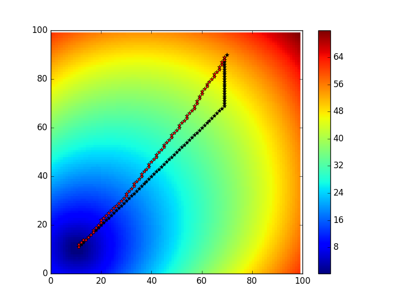
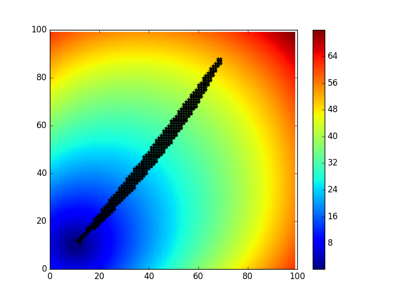

# The Shortest Path

Now I have four version for it. The first two is based on Runge-Kutta integration.
The third is one that I try to apply the Bresenham's line algorithm on discrete points,
but the result is not accruate when the path is curve, it needs to impove or is
a wrong try. The last comes from the reverse time idea in geophysics, I use it here.
The result is not a line, but the solution may be a good one for me now.

I add some comments in funciton `test_find_path4` in `test_path.py` with all four solutions.

## The modified version based on the original

## The Cython version 

I just wrote the simpliest one because I'm not familiar with Cython.
It runs about 2x faster.

## The direct Bresenham's algorithm version

It's not accruate for curve path. Maybe it can be improved, or it might be a wrong try.
It is much faster, but I don't know the exact time.

## The version based on sum of two traveltime map

Firstly, I compute the traveltime from the source location. Then, I compute the
traveltime from the receiver location. I add them and you will find the smallest
values along the path.

If I need to compute 200 sources and 200 receivers, I only need to compute traveltime for 400 times.

