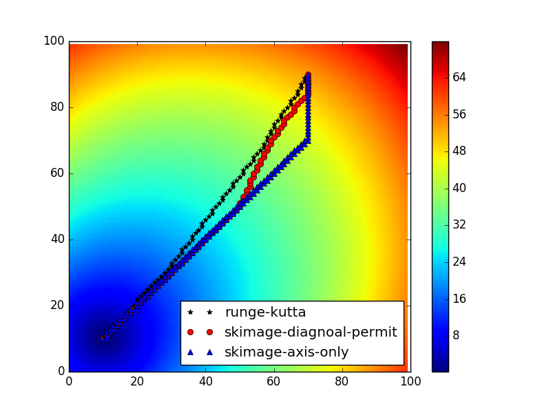

# The Shortest Path

Now I have four version for it. The first two is based on Runge-Kutta integration.
The third is one that I try to apply the Bresenham's line algorithm on discrete points,
but the result is not accruate when the path is curve, it needs to impove or is
a wrong try. The last comes from the reverse time idea in geophysics, I use it here.
The result is not a line, but the solution may be a good one for me now.

I add some comments in funciton `test_find_path4` in `test_path.py` with all four solutions.


## The modified version based on the original


## The Cython version 

I just wrote the simpliest one because I'm not familiar with Cython.
It runs a little faster.

## The direct Bresenham's algorithm version

It's not accruate for curve path. Maybe it can be improved, or it might be a wrong try.
It is much faster, but I don't know the exact time.


## The version based on sum of two traveltime map

Firstly, I compute the traveltime from the source location. Then, I compute the
traveltime from the receiver location. I add them and you will find the smallest
values along the path.

If I need to compute 200 sources and 200 receivers, I only need to compute traveltime for 400 times.


## skimage

`skimage.graph.route_through_array(array, start, end, fully_connected=True, geometric=True)[source]`

The parameter `array` is the slowness (1./speed)???



The path is different, why?

I find the path using skimage with axis-only is very similar with solution 3.


## time

```
Timer unit: 1e-06 s

Total time: 0.098992 s
File: test_path.py
Function: test_find_path4 at line 93

Line #  Hits      Time  Per Hit   % Time  Line Contents
=======================================================
    93                                    @profile
    94                                    def test_find_path4():
    95     1       333    333.0      0.3      nx = 100
    96     1         4      4.0      0.0      ny = 100
    97     1         3      3.0      0.0      loc_src = (10, 10)
    98     1         3      3.0      0.0      loc_rec = (70, 90)
    99     1        45     45.0      0.0      coordx = np.arange(nx)
   100     1         6      6.0      0.0      coordy = np.arange(ny)
   101     1      3735   3735.0      3.8      X, Y = np.meshgrid(coordx, coordy)
   102     1       318    318.0      0.3      phi = -1*np.ones_like(X)
   103     1       378    378.0      0.4      phi[np.logical_and(np.abs(X-loc_src[0]) <=1, np.abs(Y-loc_src[1])<=1)] = 1
   104     1      1615   1615.0      1.6      speed = np.sin(2*np.pi*X/200)*np.sin(2*np.pi*Y/200)
   105     1        31     31.0      0.0      speed = speed + 1.2
   106     1     11202  11202.0     11.3      t = skfmm.travel_time(phi, speed)
   107                                        # t = (X-loc_src[0])**2/5 + (Y-loc_src[1])**2/10
   108     1         3      3.0      0.0      dx = 1.
   109     1       525    525.0      0.5      grad_t_y, grad_t_x = np.gradient(t, dx)
   110     1         5      5.0      0.0      if isinstance(t, np.ma.MaskedArray):
   111                                            grad_t_y[grad_t_y.mask] = 0.0
   112                                            grad_t_y = grad_t_y.data
   113                                            grad_t_x[grad_t_x.mask] = 0.0
   114                                            grad_t_x = grad_t_x.data
   115                                    
   116     1      5000   5000.0      5.1      gradx_interp = RectBivariateSpline(coordy, coordx, grad_t_x)
   117     1      1405   1405.0      1.4      grady_interp = RectBivariateSpline(coordy, coordx, grad_t_y)
   118                                    
   119                                        ### 1. the modified version base on the original
   120                                        #--------------------------------------------------
   121     1     19009  19009.0     19.2      xl, yl = optimal_path_runge_kutta(gradx_interp, grady_interp, loc_rec, dx)
   122     1       790    790.0      0.8      grid_indx = get_curve(xl, yl, 5)
   123     1        14     14.0      0.0      ix1_1, iy1_1 = zip(*grid_indx)
   124     1      4743   4743.0      4.8      xl, yl = optimal_path_euler(gradx_interp, grady_interp, loc_rec, dx)
   125     1       734    734.0      0.7      grid_indx = get_curve(xl, yl, 5)
   126     1        12     12.0      0.0      ix1_2, iy1_2 = zip(*grid_indx)
   127                                    
   128                                    
   129                                        ### 2. Cython version
   130                                        #--------------------------------------------------
   131     1     16533  16533.0     16.7      xl, yl = optimal_path_cython.optimal_path(gradx_interp, grady_interp, loc_rec, dx)
   132     1       779    779.0      0.8      grid_indx = get_curve(xl, yl, 5)
   133     1        13     13.0      0.0      ix2, iy2 = zip(*grid_indx)
   134                                    
   135                                    
   136                                        ### 3. A version that I try to use the Bresenham's algorithm on discrete points directly
   137                                        ###    There are some problems for the curve path.
   138                                        #--------------------------------------------------
   139     1      3889   3889.0      3.9      path_points = find_path(-grad_t_x, -grad_t_y, loc_rec, loc_src)
   140     1        16     16.0      0.0      ix3, iy3 = zip(*path_points)
   141                                    
   142                                    
   143                                        ### 4. Use two travel time addition to get the path.
   144                                        ###    The path is not a line, but it's enough for me.
   145                                        ###    the parameter "percent" is trival.
   146                                        #--------------------------------------------------
   147     1        37     37.0      0.0      phi2 = -1*np.ones_like(X)
   148     1       126    126.0      0.1      phi2[np.logical_and(np.abs(X-loc_rec[0]) <=1, np.abs(Y-loc_rec[1])<=1)] = 1
   149     1      7005   7005.0      7.1      t2 = skfmm.travel_time(phi2, speed)
   150     1        16     16.0      0.0      t_sum = t + t2
   151     1        15     15.0      0.0      t_min = t_sum.min()
   152     1         2      2.0      0.0      percent = 0.003
   153     1        61     61.0      0.1      iy4, ix4 = np.where(t_sum < t_min*(1 + percent))
   154                                    
   155                                        # 5. skimage.graph.route_through_array
   156     1         2      2.0      0.0      loc_src = (10, 10)
   157     1         2      2.0      0.0      loc_rec = (90, 70)  # x, y  < -- > y, x
   158     1        34     34.0      0.0      slowness = 1./speed
   159     1     12820  12820.0     13.0      grid_indx, weight = route_through_array(slowness, loc_src, loc_rec)
   160     1        20     20.0      0.0      iy5_1, ix5_1 = zip(*grid_indx)
   161     1      5842   5842.0      5.9      grid_indx, weight = route_through_array(slowness, loc_src, loc_rec, fully_connected=False)
   162     1      1862   1862.0      1.9      iy5_2, ix5_2 = zip(*grid_indx)
   163                                    
   164                                    
   165                                        # import pylab as pl
   166                                        # pl.figure()
   167                                        # pl.pcolormesh(X, Y, speed)
   168                                        # pl.colorbar()
   169                                        # pl.plot(ix1_1, iy1_1, 'k*', label='runge-kutta')
   170                                        # # pl.plot(ix5_1, iy5_1, 'ro', label='skimage-diagnoal-permit')
   171                                        # # pl.plot(ix5_2, iy5_2, 'b^', label='skimage-axis-only')
   172                                        # pl.plot(ix1_2, iy1_2, 'ro', label='euler')
   173                                        # pl.legend(loc=4)
   174                                        # pl.show()
   175                                    
   176                                        # pl.figure()
   177                                        # pl.pcolormesh(X, Y, grad_t_x)
   178                                        # pl.colorbar()
   179                                        # pl.figure()
   180                                        # pl.pcolormesh(X, Y, grad_t_y)
   181                                        # pl.colorbar()
   182                                        # pl.show()
   183                                        # np.save('t.npy', t)
   184                                        # np.save('a.npy', grid_indx)
   185                                        # np.save('b.npy', list(path_points))
   186                                        # assert len(set(grid_indx) - path_points) == 0
   187     1         5      5.0      0.0      assert 1
```

| 1.1 runge-kutta | 1.2 euler | 2. cython | 3. B's variation | 4. time addition | 5.1 skimage-diagnoal | 5.2 axis-only |
| :------: | :--------: | :-------: | :---------:| :--------:| :-------: | :---------: |
| 20 | 5.5 | 17.5 | 3.9 | 7.3 | 13 | 7.8 | 13 | 7.8 |

Note:

1. The time above is for only 1 path. For my purpose, I need add source loops and receiver loops.
2. For 4th solution, the sum of time is that source loops adds receiver loops, not multiply.
